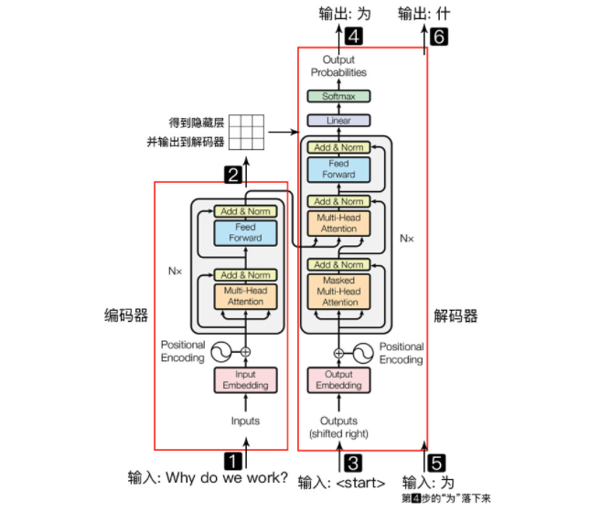
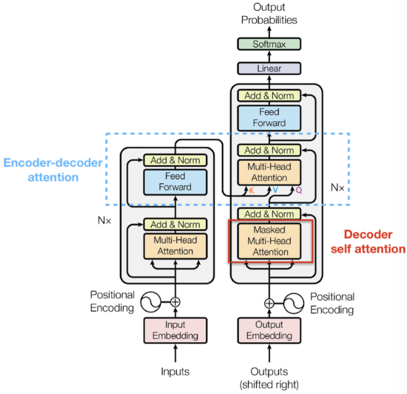
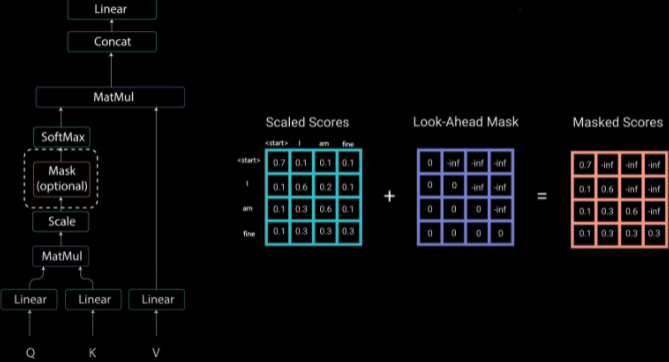

### Transformer 

> notes written by h1astro
>
> transformer能够并行处理，这样速度比RNN快。ransformer的整体结构主要分为Encoder和Decoder。Encoder部分字向量与位置编码，自注意力机制QKV向量的乘积操作很完美。多头注意力可以类比 CNN 中同时使用多个卷积核的作用，有助于网络捕捉到更丰富的信息。
>
> quotes from  [datawhale-transformer](https://github.com/datawhalechina/dive-into-cv-pytorch)

Transformer 和 LSTM 的最大区别， LSTM 的训练是迭代的、串行的，必须要等当前字处理完，才可以处理下一个字。而 Transformer 的训练时并行的，即所有字是同时训练的，这样就大大增加了计算效率。Transformer 使用了位置嵌入 (Positional Encoding) 来理解语言的顺序，使用自注意力机制（Self Attention Mechanism）和全连接层进行计算.

Transformer 模型主要分为两大部分，分别是 **Encoder** 和 **Decoder**。Encoder 负责把输入（语言序列）隐射成隐藏层，然后解码器再把隐藏层映射为自然语言序列。

### Transformer Encoder 整体结构

用公式把一个 Encoder block 的计算过程整理一下：

1). 字向量与位置编码

$X=Embedding-Lookup(X)+Positional-Encoding$

> $$ PE_{(pos,2i)} = sin(pos / 10000^{2i/d_{\text{model}}}) $$
>
> $$ PE_{(pos,2i+1)} = cos(pos / 10000^{2i/d_{\text{model}}}) $$

2). 自注意力机制

$Q=Linear_q(X)=XW_Q$

$K=Linear_k(X)=XW_K$

$V=Linear_v(X)=XW_V$

$X_{attention}=Self-Attention(Q,K,V)$

3). self-attention 残差连接与 Layer Normalization

$X_{attention}=X+X_{attention}$

$X_{attention}=LayerNorm(X_{attention})$

4). FeedForward，其实就是两层线性映射并用激活函数激活，比如说 ReLU

$X_{hidden}=Linear(ReLU(Linear(X_{attention})))$

5). FeedForward 残差连接与 Layer Normalization

$X_{hidden}=X_{attention}+X_{hidden}$

$X_{hidden}=LayerNorm(X_{hidden})$

其中

$X_{hidden}∈R^{batch\_size ∗ seq\_len. ∗ embed\_dim}$

### Transformer Decoder 整体结构

- Masked Multi-Head Self-Attention
- Multi-Head Encoder-Decoder Attention
- FeedForward Network

#### Masked Self-Attention

传统 Seq2Seq 中 Decoder 使用的是 RNN 模型，因此在训练过程中输入 t 时刻的词，模型无论如何也看不到未来时刻的词，因为循环神经网络是时间驱动的，只有当 t 时刻运算结束了，才能看到 t+1 时刻的词。而 Transformer Decoder 抛弃了 RNN，改为 Self-Attention，由此就产生了一个问题，在训练过程中，整个 ground truth 都暴露在 Decoder 中，这显然是不对的，我们需要对 Decoder 的输入进行一些处理，该处理被称为 Mask

Mask 非常简单，首先生成一个下三角全 0，上三角全为负无穷的矩阵，然后将其与 Scaled Scores 相加即可

#### Transformer 为什么需要进行 Multi-head Attention？

多次 attention 综合的结果至少能够起到增强模型的作用，也可以类比 CNN 中同时使用**多个卷积核**的作用，直观上讲，多头的注意力**有助于网络捕捉到更丰富的特征 / 信息**

多头注意力机制的作用：这种结构设计能让每个注意力机制去优化每个词汇的不同特征部分，从而均衡同一种注意力机制可能产生的偏差，让词义拥有来自更多元表达，实验表明可以从而提升模型效果。

掩码：掩代表遮掩，码就是我们张量中的数值，它的尺寸不定，里面一般只有0和1；代表位置被遮掩或者不被遮掩。

Im掩码的作用：在transformer中，掩码主要的作用有两个，一个是屏蔽掉无效的padding区域，一个是屏蔽掉来自“未来”的信息。Encoder中的掩码主要是起到第一个作用，Decoder中的掩码则同时发挥着两种作用。

#### Transformer 相比于 RNN/LSTM，有什么优势？为什么？

1. RNN 系列的模型，无法并行计算，因为 T 时刻的计算依赖 T-1 时刻的隐层计算结果，而 T-1 时刻的计算依赖 T-2 时刻的隐层计算结果
2. Transformer 的特征抽取能力比 RNN 系列的模型要好

### 